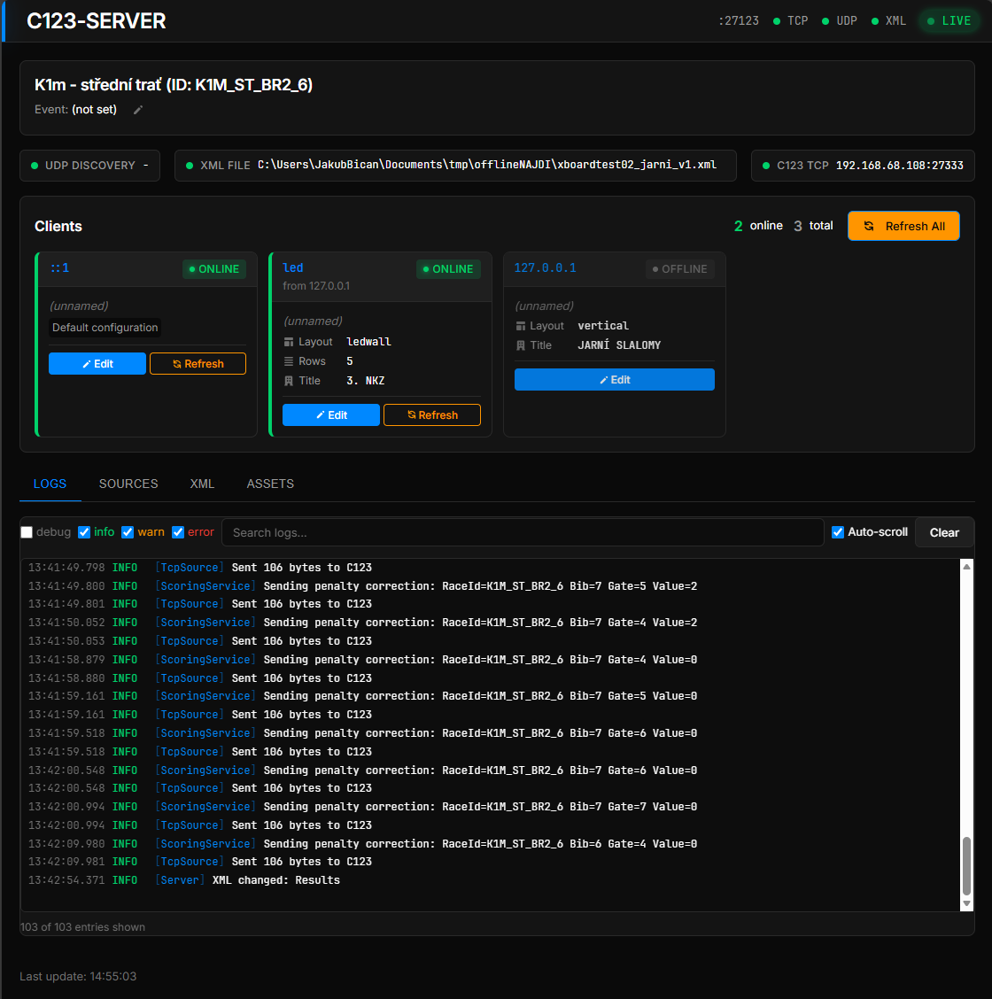
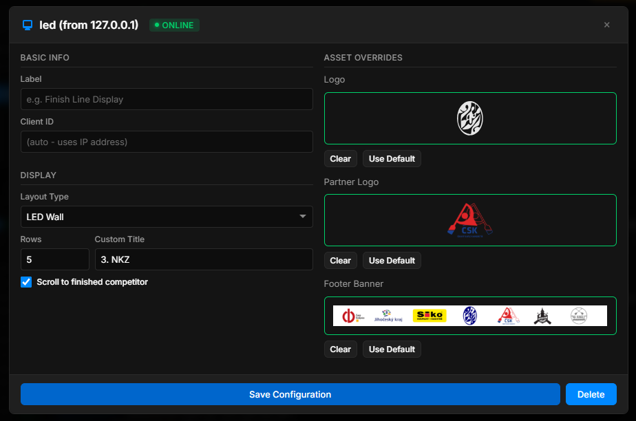
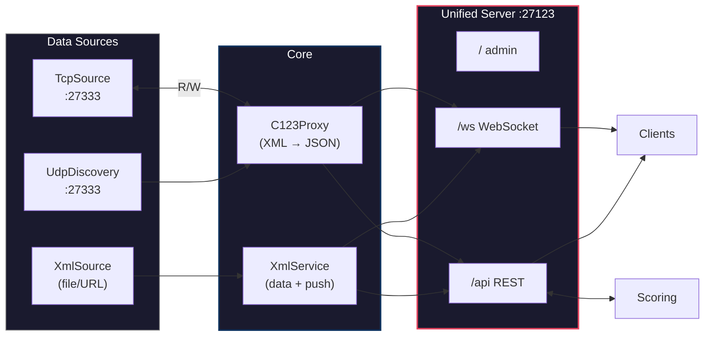

# C123 Server

Smart middleware for canoe slalom timing - bridge between Canoe123 timing software and scoreboards.

| Admin Dashboard | Client Editor |
|:---------------:|:-------------:|
|  |  |

## Features

- **Zero configuration** - Works out of the box on Windows with auto-discovery and auto-detect
- **Single port architecture** - All services (Admin, WebSocket, REST API) on port 27123
- **Auto-discovery** - Automatically finds C123 on the local network via UDP broadcast
- **Native C123 protocol** - Passes authentic C123 data (XML → JSON)
- **XML REST API** - Full access to race data (schedule, participants, results)
- **C123 Write API** - Send scoring, timing, and DNS/DNF commands back to C123
- **Admin dashboard** - Web interface for monitoring and configuration
- **Windows auto-config** - Automatically detects XML path from Canoe123 settings
- **Persistent settings** - Configuration survives restarts

## Zero Configuration (Windows)

On Windows, the server works out of the box with no configuration needed:

```bash
# 1. Make sure Canoe123 has been run at least once (creates config)
# 2. Start the server
npm start

# That's it! The server will:
# - Find running C123 on the network (UDP auto-discovery)
# - Load XML file path from Canoe123 settings (auto-detect)
# - Start serving on http://localhost:27123
```

### How Auto-Discovery Works

The server broadcasts UDP packets on port 27333 to find Canoe123:

1. **UDP broadcast** - Sends discovery packets to the local network
2. **C123 responds** - Canoe123 replies with its IP address
3. **TCP connection** - Server connects to C123 for real-time data

No need to know the C123 IP address - just run the server and it finds C123 automatically.

### How Auto-Detect Works (Windows)

The server reads Canoe123's `user.config` file to find XML paths:

| Mode | Description |
|------|-------------|
| **auto-offline** | Uses `AutoCopyFolder` path (default, recommended) |
| **auto-main** | Uses `CurrentEventFile` path (main event file) |
| **manual** | User-specified path |

The offline copy is recommended because it's updated atomically and safer to read.

## Installation

```bash
npm install
npm run build
```

## Quick Start

```bash
# Development mode with hot reload
npm run dev

# Production mode (after build)
npm start

# With options (note the -- to pass arguments)
npm start -- --host 192.168.1.5
npm start -- --xml /path/to/results.xml
```

The server starts on port **27123** with:
- Admin dashboard: http://localhost:27123/
- WebSocket: ws://localhost:27123/ws
- REST API: http://localhost:27123/api/

## Use Cases

### Scoreboards

Display real-time results on TVs, LED walls, or web pages:

```javascript
const ws = new WebSocket('ws://server:27123/ws');
ws.onmessage = (e) => {
  const msg = JSON.parse(e.data);
  if (msg.type === 'OnCourse') updateDisplay(msg.data);
};
```
For example: [c123-scoreboard](https://github.com/OpenCanoeTiming/c123-scoreboard)

### Scoring Applications

Send penalties and timing commands to C123:

```bash
# Send penalty (2 seconds on gate 5)
curl -X POST http://server:27123/api/c123/scoring \
  -H "Content-Type: application/json" \
  -d '{"bib": "10", "gate": 5, "value": 2}'

# Mark DNS (Did Not Start)
curl -X POST http://server:27123/api/c123/remove-from-course \
  -H "Content-Type: application/json" \
  -d '{"bib": "10", "reason": "DNS"}'
```
For example: [c123-scoring-terminal-app](https://github.com/OpenCanoeTiming/c123-scoring)

### Custom Integrations

Access race data via REST API for custom applications:

```bash
# Get race schedule
curl http://server:27123/api/xml/schedule

# Get merged BR1+BR2 results
curl http://server:27123/api/xml/races/K1M_ST_BR1_6/results?merged=true
```

## Command Line Options

```
Usage: npm start -- [command] [options]

Commands:
  run         Run the server (default)
  install     Install as Windows service
  uninstall   Uninstall Windows service
  start       Start the Windows service
  stop        Stop the Windows service

Options:
  --host <ip>         C123 host IP (disables auto-discovery)
  --port <port>       C123 source port (default: 27333)
  --server-port <p>   Server port for HTTP + WebSocket (default: 27123)
  --xml <path>        XML file path for results data
  --no-discovery      Disable UDP auto-discovery
  --no-autodetect     Disable Canoe123 XML autodetection (Windows)
  -d, --debug         Enable verbose debug logging
  -h, --help          Show help message
  -v, --version       Show version

Environment variables:
  C123_SERVER_PORT    Server port (overrides default, overridden by --server-port)
  PORT                Fallback for server port (if C123_SERVER_PORT not set)
```

## Ports

| Service | Port | Description |
|---------|------|-------------|
| C123 (upstream) | 27333 | TCP + UDP (Canoe123 software) |
| **C123 Server** | 27123 | All services (HTTP + WS) |

### Endpoints on port 27123

| Path | Protocol | Purpose |
|------|----------|---------|
| `/` | HTTP | Admin dashboard (SPA) |
| `/ws` | WebSocket | Real-time C123 data + XML change notifications |
| `/api/*` | HTTP | REST API (status, config, XML data) |
| `/api/discover` | HTTP | Server discovery endpoint |
| `/api/c123/*` | HTTP | C123 Write API (scoring, timing) |

## WebSocket Messages

Real-time C123 data in JSON format:

```json
{
  "type": "OnCourse",
  "timestamp": "2025-01-02T10:30:45.123Z",
  "data": {
    "total": 2,
    "competitors": [
      {
        "bib": "9",
        "name": "SMITH John",
        "time": "81.15",
        "dtFinish": null,
        "rank": 8
      }
    ]
  }
}
```

Message types: `TimeOfDay`, `OnCourse`, `Results`, `RaceConfig`, `Schedule`, `XmlChange`

## REST API

### Read Operations

```bash
# Server status
GET /api/status

# Race schedule
GET /api/xml/schedule

# Participants
GET /api/xml/participants

# Race results
GET /api/xml/races/:id/results

# Merged BR1+BR2 results
GET /api/xml/races/:id/results?merged=true
```

### Write Operations (C123)

```bash
# Send penalty
POST /api/c123/scoring
{ "bib": "10", "gate": 5, "value": 2 }

# Remove from course (DNS/DNF/CAP)
POST /api/c123/remove-from-course
{ "bib": "10", "reason": "DNS" }

# Manual timing impulse
POST /api/c123/timing
{ "bib": "10", "channelPosition": "Finish" }
```

See [docs/REST-API.md](docs/REST-API.md) for full API documentation.

## Windows Service

Install as a Windows service for automatic startup:

```bash
npm start -- install
npm start -- start
```

Manage the service:

```bash
npm start -- stop
npm start -- uninstall
```

## Configuration

### Persistent Settings

Settings are automatically saved and restored across restarts:

| Platform | Settings Path |
|----------|---------------|
| Windows | `%APPDATA%\c123-server\settings.json` |
| Linux/macOS | `~/.c123-server/settings.json` |

Settings include:
- XML file path and source mode
- Event name override
- Server port
- Client configurations

## Admin Dashboard

Open http://localhost:27123 to access the admin dashboard:

- View connected scoreboards
- Monitor data sources (C123, XML)
- Configure XML source mode (auto-main, auto-offline, manual)
- Set event name override
- Manage client configurations
- View real-time logs
- Force refresh all connected clients

## Architecture



**Data Flow:**
- **Read path**: C123 → TcpSource → C123Proxy → WebSocket/REST → Clients
- **Write path**: Scoring App → REST API → C123Proxy → TcpSource → C123

## Development

```bash
# Development mode with hot reload
npm run dev

# Run tests
npm test

# Type checking
npm run typecheck

# Linting
npm run lint

# Build
npm run build
```

## Troubleshooting

### Connection Issues

**Cannot connect to C123 (Canoe123)**
- Verify C123 is running and broadcasting on port 27333
- Check that both machines are on the same network
- On Windows, ensure Windows Firewall allows UDP/TCP port 27333
- Try specifying the C123 host directly: `npm start -- --host 192.168.1.5`

**Scoreboards cannot connect**
- Ensure port 27123 is not blocked by firewall
- On Windows, add firewall rule: `netsh advfirewall firewall add rule name="C123 Server" dir=in action=allow protocol=TCP localport=27123`
- Check that the server is listening: visit http://localhost:27123 in browser

### XML Issues

**XML not detected on Windows**
- Ensure Canoe123 has been run at least once (creates user.config)
- Check if AutoCopyFolder is configured in Canoe123
- Use `--xml <path>` to specify path manually
- Use `--no-autodetect` to disable autodetection and set path via admin UI

**XML not updating**
- For network paths (SMB), the server uses polling (not filesystem events)
- Default poll interval is 1 second (configurable via debounce settings)
- Verify the XML file is being modified by Canoe123

### General

**Server won't start**
- Check if port 27123 is already in use: `netstat -an | find "27123"`
- Use a different port: `npm start -- --server-port 8080`
- Check logs for specific error messages

**Windows Service issues**
- Ensure you run the command prompt as Administrator
- Check Windows Event Log for service-related errors
- Verify node-windows optional dependency is installed

## Documentation

- [C123-PROTOCOL.md](docs/C123-PROTOCOL.md) - C123 protocol reference (WebSocket messages)
- [REST-API.md](docs/REST-API.md) - REST API documentation
- [INTEGRATION.md](docs/INTEGRATION.md) - Scoreboard integration guide
- [CLIENT-CONFIG.md](docs/CLIENT-CONFIG.md) - Remote client configuration
- [SCOREBOARD-REQUIREMENTS.md](docs/SCOREBOARD-REQUIREMENTS.md) - What scoreboards must implement

## License

MIT
